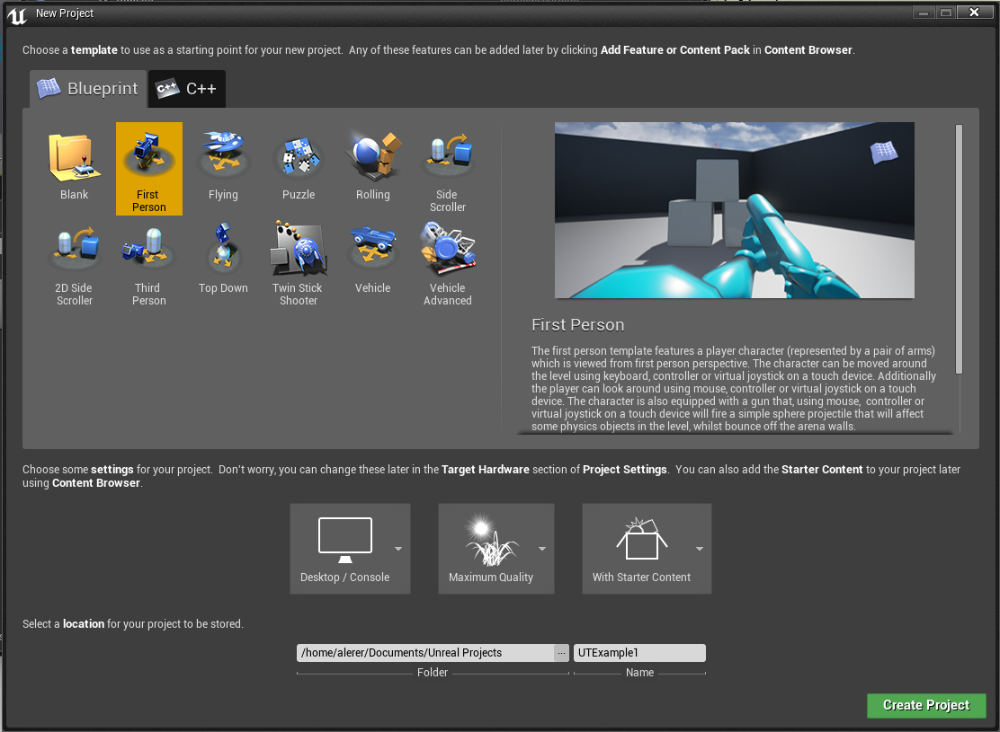
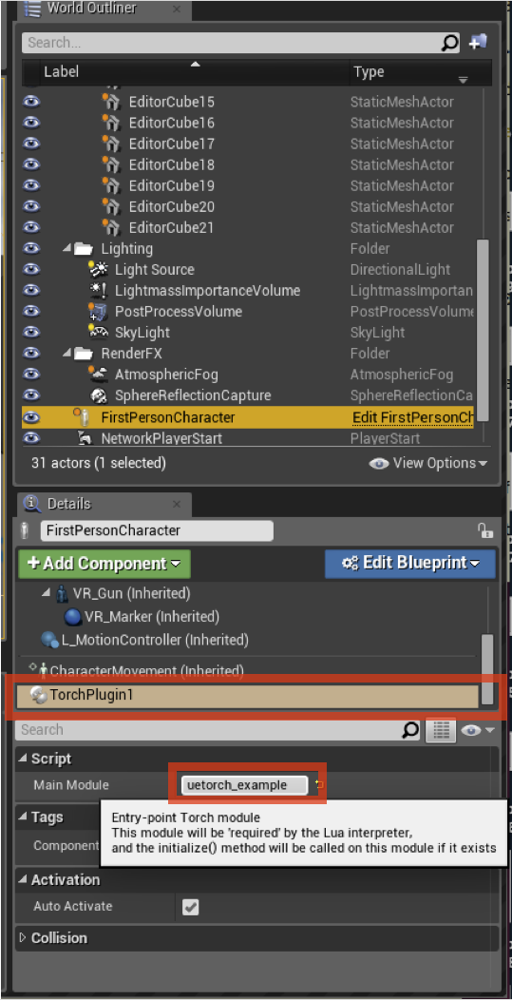

# UnrealTorch
UnrealTorch is a ... and solves ...

## Examples
...

## Requirements
UnrealTorch requires or works with
* Mac OS X or Linux
* ...


## Installing UnrealTorch
1. Download and install torch from https://github.com/torch/torch-distro. We would like to use Lua 5.2, so before installing, replace LUAJIT21 with LUA52 in install<span></span>.sh.
2. Set up an Epic Games account at https://github.com/EpicGames/UnrealEngine/, needed to download Unreal Engine.
3. Visit https://wiki.unrealengine.com/Building_On_Linux to learn how to configure your system for running Unreal Engine on Linux.
4. Install UnrealEngine / UnrealTorch
 ```bash
 git clone https://github.com/EpicGames/UnrealEngine.git
 cd UnrealEngine
 # UnrealTorch was written for UnrealEngine-4.8
 git checkout 4.8
 ./Setup.sh && ./GenerateProjectFiles.sh 
 
 # clone UnrealTorch into the plugins directory
 git clone https://github.com/facebook/UnrealTorch.git Engine/Plugins/UnrealTorch
 Engine/Plugins/UnrealTorch/Setup.sh
 
 # grab some coffee, this will take a long time
 make
 ```
5. Profit!

## Getting Started with UnrealTorch

1. source Engine/Plugins/UnrealTorch/unrealtorch\_activate.sh

2. Launch Unreal Engine 
 ```bash
 cd Engine/Binaries/Linux
 ./UE4Engine
 ```

3. Create a new 'First Person' project
 

4. Lets add a TorchPlugin component to the player. In the 'World Outliner' panel, click 'Edit FirstPersonCharacter'.
 

 Inside the window that pops up, click 'Add Component, and select 'Torch Plugin'. This will add a Torch Plugin component to FirstPersonCharacter.
 

5. Now we just need to set the module name for the UnrealTorch script that the component will run. We'll use the example script in UnrealTorch/Scripts/unrealtorch\_example.lua. The unrealtorch\_activate.sh script already added UnrealTorch/Scripts to our path, so if we got back to the World Outliner, we can just set the 'Main Module' field on the TorchPlugin to 'unrealtorch\_example'.
 

6. Press the 'Play' button. The game should freeze and you will notice that on the command line you have a torch prompt. That's because the example called `start_repl()` in the initialization function. You can type `break` to exit the REPL. The player will now move towards the cubes, based on the simple tick function inside unrealtorch\_example.lua. Go take a look at that script now.
7. You may want to call a Lua function from inside Unreal Engine's [Blueprints scripting language](https://docs.unrealengine.com/latest/INT/Engine/Blueprints/index.html). Lets see how to do that now.
TODO

## Full documentation
To learn how to develop Unreal Engine projects, see the Unreal Engine documentation at https://docs.unrealengine.com/latest/INT/.

In-line documentation for the APIs provided by UnrealTorch can be found in UnrealTorch/Scripts/unrealtorch.lua.

More coming soon.

## Join the UnrealTorch community
TODO

## License
UnrealTorch is BSD-licensed. We also provide an additional patent grant.
